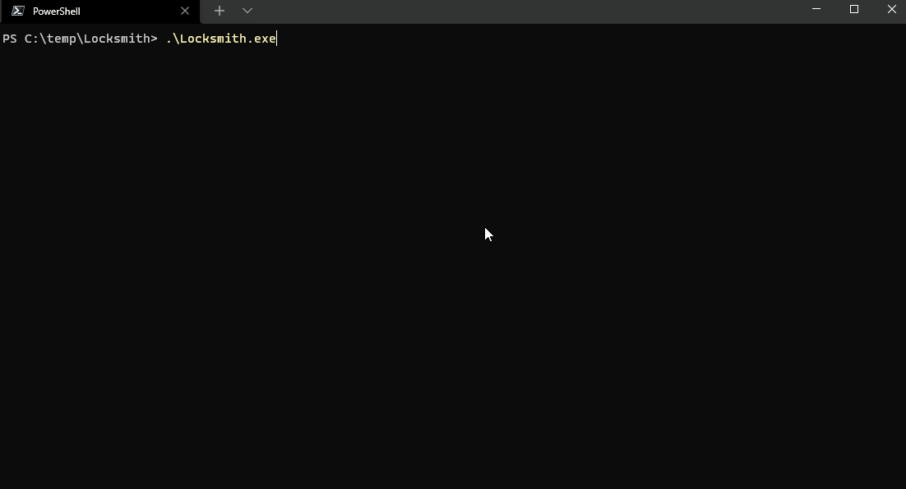

<h1 align=center><code>Locksmith</code></h1>
<p align=center>
  
</p>

Locksmith is a semi-automated step-like tool which allow simplest way to test secrets against several API

## Features
- Template based logic allowing locksmith to be extensible. See [Locksmith Templates](https://github.com/rodrigoramosrs/locksmith-templates)
- Wide template base to test agains most common api's 
- Easy to use, and step-like guided for test secrets.
- Build for windows/linux/mac, even a toaster maybe =). 

## How to use?

- Windows 
```console
$ locksmith.exe
```

- Unix

```console
$ locksmith
```

The cli will guide you to select the right test for you.

## I want more tests. So, can i extend the test base?

Sure, the template model is for that propouse. You don't even need to know how to write a line of code.

Just follow to the [Locksmith Templates](https://github.com/rodrigoramosrs/locksmith-templates) repository to start your journey


## Credits

Creators:
- [ME](https://github.com/rodrigoramosrs) 
- [Edivan Galindo](https://github.com/edivangalindo)


Poc's and inspiration:
-  [keyhacks](https://github.com/streaak/keyhacks)